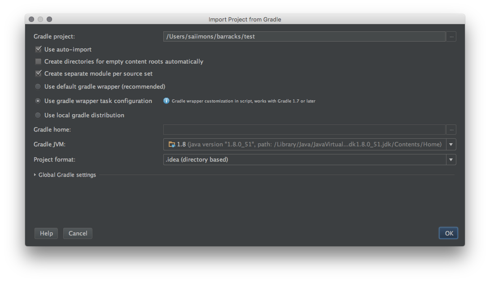

# Install repo
See [here](https://source.android.com/source/downloading.html)

# Init the barracks repo
```
repo init -u ssh://git@github.com/barracksiot/manifest
```

# Get the source !
```
repo sync
```

# Import the project in IntelliJ
